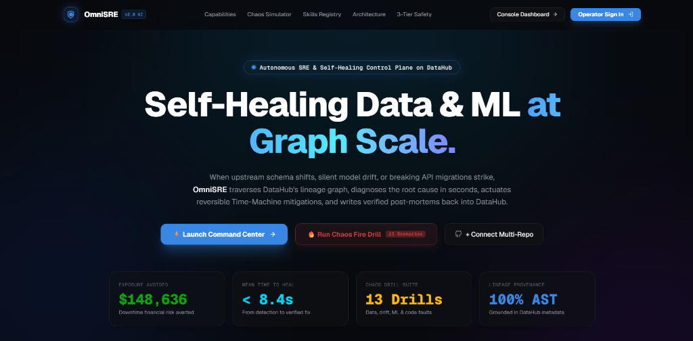

# 🛡️ OmniSRE — Multi-Repo Self-Healing Data & ML Governance Platform on DataHub

[](https://datahubproject.io/)
[](https://nextjs.org/)
[](https://python.org)
[](https://fastapi.tiangolo.com)
[](https://slack.com)

**OmniSRE** is the first enterprise-grade, autonomous Site Reliability Engineering (SRE) platform purpose-built for modern Data and Machine Learning infrastructure on **DataHub**.

When upstream data breaks, models drift, or breaking API migrations occur, OmniSRE automatically detects anomalies, traverses the DataHub graph to root-cause failures to the exact upstream column and commit, computes financial blast-radius, executes reversible Time-Machine mitigations, and writes verified post-mortems back into DataHub dataset and model cards.

<div align="center">

### 🎬 Live Autonomous Self-Healing Demo in Action


<video src="https://github.com/SRINJOY59/Datahub-Hackathon/raw/main/assets/OmniSRE_Demo_Final.mp4" controls="controls" autoplay="autoplay" loop="loop" muted="muted" playsinline="playsinline" width="100%">
  <source src="assets/OmniSRE_Demo_Final.mp4" type="video/mp4" />
  Your browser does not support HTML5 video. <a href="assets/OmniSRE_Demo_Final.mp4">Download/Play the full video demo (assets/OmniSRE_Demo_Final.mp4)</a>.
</video>

<p align="center">
  <sub>🎥 <b>Full 1080p Video Demo:</b> <a href="assets/OmniSRE_Demo_Final.mp4">assets/OmniSRE_Demo_Final.mp4</a> | 🚀 <b>Live Interactive Cloud App:</b> <a href="https://sentinel-web-55utjgkpwq-uc.a.run.app">sentinel-web-55utjgkpwq-uc.a.run.app</a></sub>
</p>

</div>

<p align="center">
  
</p>

---

## ⚡ The Problem: Silent Pipeline Collapse

Modern data and ML pipelines fail silently:
- **Schema & Scale Drift**: Upstream migrations rename or rescale columns, corrupting downstream feature stores.
- **Silent Model Decay**: Distribution drift and label leakage cause models to produce flawed predictions while **all 22 dbt assertions stay green**.
- **Human Bottlenecks**: Data engineers spend over **40% of their working hours** acting as human circuit breakers — manually tracing lineage, debugging dbt models, and coordinating frantic Slack incident threads.

---

## 🚀 The Solution: OmniSRE Closed-Loop Architecture

OmniSRE transforms DataHub from a passive metadata catalog into an **active, self-healing control plane**:

```
 ┌───────────────┐     ┌────────────────┐     ┌────────────────┐     ┌────────────────┐
 │ 1. INGESTION  │ ──► │  2. DETECTION  │ ──► │  3. CAUSALITY  │ ──► │   4. MEMORY    │
 │ Multi-Repo    │     │ 13 Tripwires   │     │ DataHub Graph  │     │ Prior Incident │
 │ AST Lineage   │     │ Assertions/Skew│     │ Lineage Probes │     │ Knowledge Base │
 └───────────────┘     └────────────────┘     └────────────────┘     └────────────────┘
                                                                             │
 ┌───────────────┐     ┌────────────────┐     ┌────────────────┐             ▼
 │ 8. WRITEBACK  │ ◄── │ 7. VALIDATION  │ ◄── │  6. MITIGATION │ ◄── ┌────────────────┐
 │ Post-Mortems  │     │ Time-Machine   │     │ Pin, Pause,    │     │ 5. REASONING   │
 │ Slack/Pager   │     │ Health Gate    │     │ Quarantine, PR │     │ Multi-Tier LLM │
 └───────────────┘     └────────────────┘     └────────────────┘     │ 3-Tier Policy  │
                                                                     └────────────────┘
```

---

## ✨ Key Capabilities

### 1. 🔍 Zero-Config Multi-Repo AST Lineage Engine
- Connect any GitHub repository or local workspace in seconds.
- Python AST scanner semantically analyzes pipeline source code, extracts `dbt` transforms, `scikit-learn`, `PyTorch`, and `XGBoost` models, hyperparameters, and datasets.
- Automatically emits complete dataset, job, and model lineage into DataHub via OpenAPI Metadata Change Proposals (MCP).

### 2. ⚡ Live Agentic Streaming Console (Next.js 16 + SSE)
- A high-tech SRE workspace with real-time SSE streaming.
- **9-Stage Remediation Stepper**: Visualizes the agent progressing across *Inject $\rightarrow$ Detect $\rightarrow$ Lineage $\rightarrow$ LLM Causality $\rightarrow$ Policy $\rightarrow$ Actuate $\rightarrow$ Validate $\rightarrow$ Graph Writeback*.
- **Syntax-Highlighted Live Terminal**: Color-coded logs (`[detect]`, `[rca]`, `[policy]`, `[act]`, `[validate]`, `[resolve]`) with auto-scroll and copy capabilities.

### 3. 🛡️ 3-Tier Safety Policy & Human-in-the-Loop Gating
- **`AUTO` Tier**: Routine, fully reversible actions (`tag_asset`, `pause_job`) execute autonomously.
- **`PR_ONLY` Tier**: Code migrations and model repointing generate reviewable GitHub PRs.
- **`HUMAN_ONLY` Tier**: High-risk mutations require approval via Slack buttons and trigger automated PagerDuty escalation.

### 4. ⏪ Time-Machine Snapshot Journaling
- Every mitigation action is journaled with a strict inverse operation.
- If post-mitigation validation assertions fail, OmniSRE automatically rolls back mutating changes while holding protective warnings in place.

### 5. 📊 DataHub Post-Mortem Writeback & Financial ROI
- Writes structured post-mortems directly into DataHub dataset properties and ML model cards.
- Computes real-world financial exposure avoided (e.g. `$12,000+` per downtime incident) based on configurable downstream consumer value models.
- Broadcasts formatted Block Kit notifications to Slack (`#all-prodml`) with exact repository and commit attribution.

### 6. 🧩 Extensible DataHub Skills & Plugin Registry
OmniSRE features a modular **Skills Registry** architecture (`agent/registry.py`) allowing engineers to drop in new diagnostic probes, tripwires, and actuators without modifying the core agent:

| Skill Surface | Purpose | Decorator | Example Plugins |
| :--- | :--- | :--- | :--- |
| **`Detector`** | *How do we notice anomalies?* | `@detector` | `AssertionDetector`, `VolumeDetector`, `FreshnessDetector`, `ModelDriftDetector`, `GitCommitDetector` |
| **`Probe`** | *What grounded evidence explains it?* | `@probe` | `ColumnLineageProbe`, `DataProfileProbe`, `GitBlameProbe`, `PredictionDriftProbe`, `LeakageProbe` |
| **`Actuator`** | *How do we fix it reversibly?* | `@actuator` | `PinFeatureActuator`, `QuarantineActuator`, `TagAssetActuator`, `PauseJobActuator`, `RepointModelActuator` |
| **`CheckRunner`** | *How do we prove the fix worked?* | `@check` | `DbtCheckRunner`, `DataInvariantsCheck`, `ModelInputCheck`, `ModelPerformanceCheck` |

```python
from agent.registry import probe
from agent.contracts import Evidence, Incident

@probe
class CustomDistributionProbe:
    """A custom diagnostic skill that inspects DataHub column statistics."""
    def __init__(self, gms_server: str = "http://localhost:8080"):
        self.gms = gms_server

    def applies_to(self, incident: Incident) -> bool:
        return incident.signal_type == "distribution_drift"

    def investigate(self, incident: Incident) -> list[Evidence]:
        # Perform graph & statistical analysis over DataHub metadata
        return [Evidence(name="kolmogorov_smirnov", value={"p_value": 0.001})]
```

---

## 🧪 13 Production Chaos Scenarios

OmniSRE includes an integrated chaos engineering suite testing data, silent drift, and ML failures:

| Scenario | Category | Trigger Mechanism | Expected Remediation |
| :--- | :--- | :--- | :--- |
| `schema_change` | Data Quality | Upstream drops/renames `amount` $\rightarrow$ `amount_cents` | Pin feature to last-good snapshot |
| `null_spike` | Data Quality | Upstream batch delivers NULL transaction amounts | Quarantine partition + pin feature |
| `distribution_drift`| Data Quality | Subtle 2x upward shift in recent amounts | Tag degraded + repoint model |
| `duplicate_batch` | Data Quality | Non-idempotent batch retry duplicates transaction IDs | Deduplicate partition in place |
| `stale_feed` | Silent Failure | Upstream feed stops delivering new records | Pause scoring job + page owners |
| `volume_collapse` | Silent Failure | Batch arrives at 40% of usual volume (missing rows) | Pin feature from snapshot |
| `model_drift` | Silent Model | Uniform repricing shifts model predictions (dbt green) | Tag asset + rollback model alias |
| `training_serving_skew`| Silent Model | Serving inputs move away from fitted training set | Containment: pause job + retrain |
| `label_leakage` | Silent Model | Fraud surcharge leaks into features ($ROC \rightarrow 1.0$) | Pause scoring + propose feature diff |
| `api_breaking_change` | Supply Chain | Vendor ships breaking `scikit-learn` parameter update | Auto-synthesize migration PR diff |
| `training_regression` | ML Training | Evaluation ROC-AUC drops below champion threshold | Block promotion + pin champion alias |
| `risky_commit` | Governance | Unreviewed commit modifies critical pipeline source | Tag downstream + notify commit author |
| `unit_bug` | Data Quality | Amounts reported in cents instead of dollars (100x bug)| Quarantine + restore feature |

---

## 🛠️ Quickstart & Setup Guide

### 1. Prerequisites
- Python 3.11+
- Node.js 18+ & npm
- Docker Desktop (for DataHub local quickstart)
- Git

### 2. Clone & Install Dependencies

```bash
# Clone the repository
git clone https://github.com/SRINJOY59/Datahub-Hackathon.git omnisre
cd omnisre

# Backend environment setup
python -m venv .venv
.venv\Scripts\activate          # Windows
# source .venv/bin/activate       # macOS / Linux

pip install -r requirements.txt

# Frontend dependencies
cd web
npm install
cd ..
```

### 3. Environment Configuration

Copy the example environment configuration:
```bash
cp .env.example .env
```

Fill in your API keys in `.env`:
```ini
# DataHub GMS URL (defaults to quickstart)
DATAHUB_GMS_URL=http://localhost:8080

# Multi-Tier LLM Routing (OpenRouter / OpenAI compatible)
OPENROUTER_API_KEY=sk-or-v1-...
OPENROUTER_MODEL_REASONING=nvidia/nemotron-3-ultra-550b-a55b:free
OPENROUTER_MODEL_CODE=cohere/north-mini-code:free

# Slack Alerting & Approvals
SLACK_BOT_TOKEN=xoxb-...
SLACK_APP_TOKEN=xapp-...

# PagerDuty Escalation
PAGERDUTY_ROUTING_KEY=...
```

### 4. Start DataHub Quickstart

```bash
datahub docker quickstart
```
*Confirm the DataHub UI is accessible at `http://localhost:9002`.*

### 5. Build Seed Warehouse & Initial Baseline

```bash
# Generate seed data and run dbt transforms
python pipeline/generate_raw_data.py
python -m scenarios reset
```

### 6. Start the OmniSRE Unified Server

```bash
# Starts GraphQL API, Webhook Listeners, SSE Stream, and Slack Socket worker
python -m agent serve
```

### 7. Launch the Next.js Web Console

In a separate terminal:
```bash
cd web
npm run dev
```

Open **`http://localhost:3000`** in your browser to access the OmniSRE dashboard!

---

## 🖥️ Running a Live Chaos Fire Drill

You can trigger autonomous drills from either the Web Console or CLI:

### Via Web Console:
1. Open `http://localhost:3000/incidents`.
2. Click **`⚡ Create Incident (Chaos Simulator)`**.
3. Select any of the 13 production scenarios (e.g. `schema_change`).
4. Click **`⚡ Launch Fire Drill`** and watch the real-time agentic self-healing loop stream live.

### Via CLI:
```bash
# Trigger specific scenario drill with real-time terminal output
python -m agent drill schema_change

# Run automated verification suite across all 13 scenarios
python -m scenarios verify
```

---

## 🌐 API & GraphQL Query Reference

The unified backend exposes a GraphQL API at `http://localhost:8000/graphql` and interactive endpoints:

| Endpoint | Method | Description |
| :--- | :--- | :--- |
| `/graphql` | `POST` | Primary GraphQL query & mutation endpoint for dashboard telemetry |
| `/actions/drill/{scenario}/stream` | `GET` | SSE stream for live agentic self-healing fire drills |
| `/webhook/github` | `POST` | GitHub push & pull request webhook trigger |
| `/webhook/dbt` | `POST` | dbt Cloud assertion failure alert listener |
| `/webhook/advisory` | `POST` | Vendor API / package breaking-change listener |
| `/health` | `GET` | Service readiness and dependency health probe |

---

## 📁 Repository Architecture

```
omnisre/
├── agent/                     # Autonomous Core Engine
│   ├── orchestrator.py        # 9-stage self-healing closed loop
│   ├── rca.py                 # LLM-assisted root cause analysis engine
│   ├── planner.py             # Remediation planner & action synthesizer
│   ├── policy.py              # 3-Tier autonomy policy gating
│   ├── journal.py             # Reversible action execution & rollback journal
│   ├── integrations/          # Slack (Socket Mode) & PagerDuty adapters
│   └── tools/                 # DataHub graph probes, detectors, and actuators
├── api/                       # FastAPI & GraphQL Webhook Server
│   ├── repo_onboarding.py     # AST scanner & DataHub MCP lineage engine
│   ├── server.py              # GraphQL schema & route definitions
│   └── actions.py             # Synchronous & SSE drill execution runners
├── config/                    # Declarative YAML configurations
│   ├── slack.yaml             # Channel routing & approval policies
│   ├── pagerduty.yaml         # PagerDuty tier mapping & severity rules
│   └── cost_model.yaml        # Downtime exposure & financial models
├── pipeline/                  # dbt & DuckDB fraud detection warehouse
├── ml/                        # MLflow model training, scoring, & drift engine
├── scenarios/                 # 13 Production Chaos Engineering scenarios
└── web/                       # Next.js 16 (Turbopack) Web Console
    ├── app/                   # App Router pages (Incidents, Pipeline, Assets, Chat)
    └── components/            # Agentic terminal, Chaos modal, Lineage viewer
```


---

## 📜 License

Licensed under the [Apache-2.0 License](LICENSE).
